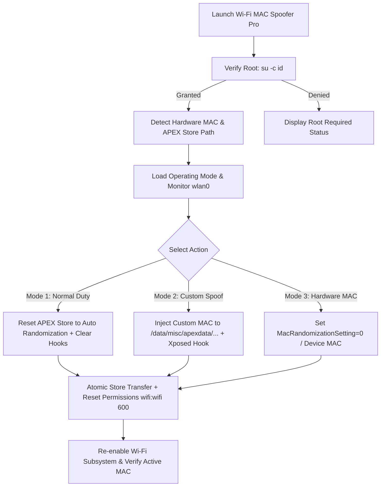

# 📡 Wi-Fi MAC Spoofer Pro (Android 12 – 17+ / Google Pixel Ready)

[](https://developer.android.com/)
[](https://kotlinlang.org/)
[](https://m3.material.io/)
[](https://github.com/topjohnwu/Magisk)
[](https://github.com/LSPosed/LSPosed)

**Wi-Fi MAC Spoofer Pro** is an advanced, modern Android root application designed to overcome the strict Wi-Fi driver and kernel limitations in modern Android versions (including **Google Pixel 6, 7, 8, 9 on Android 12, 13, 14, 15, 16, 17+**).

It combines a **Direct Root APEX Wi-Fi Store Injector**, **Native LSPosed / Xposed System Server Hooks**, and a **1-Click 3-Mode Controller**.

---

## 🚀 Why Traditional MAC Changers Fail on Modern Devices

On modern devices like the **Google Pixel 6 (Tensor G1 / Broadcom BCM4389)** running modern Android:
1. **Driver Blocks**: The Linux kernel driver rejects `ip link set wlan0 address ...` with `RTNETLINK answers: Operation not supported`.
2. **Framework Overwrite**: Android's `system_server` (`wificond`, `netd`, `WifiNative`) automatically resets manual shell changes and forces its own per-SSID randomized MAC.
3. **APEX Modularization**: Wi-Fi configuration moved from legacy paths to protected Mainline APEX storage (`/data/misc/apexdata/com.android.wifi/WifiConfigStore.xml`).

**Wi-Fi MAC Spoofer Pro solves this completely** by operating simultaneously at the **APEX Wi-Fi Storage Layer** and the **Java Framework Hook Layer (LSPosed)**!

---

## 🌟 3 Dedicated Operating Modes

The app gives you total flexibility with 3 distinct operating modes:

```
┌────────────────────────────────────────────────────────────────────────┐
│                        3 DEDICATED OPERATING MODES                     │
├────────────────────────────────────────────────────────────────────────┤
│ 🟢 Mode 1: Normal Duty (Android Auto)                                  │
│    • Gives the phone back its full default behavior.                   │
│    • Android dynamically generates a unique randomized MAC per SSID.   │
│    • Zero interference — Google OS standard privacy.                  │
│                                                                        │
│ 🔵 Mode 2: Custom MAC Spoof                                            │
│    • Injects your custom or generated MAC into the APEX Wi-Fi Store.   │
│    • Overrides system_server via built-in LSPosed hooks.               │
│    • Connected router only sees your chosen MAC address.               │
│                                                                        │
│ 🟡 Mode 3: Factory Hardware MAC                                        │
│    • Disables MAC randomization completely (MacRandomizationSetting=0).│
│    • Forces device to use its genuine factory physical hardware MAC.   │
└────────────────────────────────────────────────────────────────────────┘
```

---

## 💡 System Architecture & Workflow



---

## ⚡ Key Technical Features

### 1. 🛡️ Mainline APEX Wi-Fi Engine
* Targets `/data/misc/apexdata/com.android.wifi/WifiConfigStore.xml` (with legacy fallback to `/data/misc/wifi/WifiConfigStore.xml`).
* Atomic safe cache transfer prevents shell string escaping corruption.
* Automatically restores Unix ownership (`chown wifi:wifi`), permissions (`chmod 600`), and SELinux contexts (`restorecon`).

### 2. 🧩 Integrated LSPosed / Xposed Module
* This app is **itself a full LSPosed Module** (no 3rd-party paid apps needed).
* Hooks `android.net.wifi.WifiConfiguration.getRandomizedMacAddress()`.
* Hooks `com.android.server.wifi.WifiNative.setMacAddress()`.
* Hooks `android.net.wifi.WifiInfo.getMacAddress()`.
* Seamlessly reads active spoof configuration across UID boundaries via `XSharedPreferences`.

### 3. 🎲 RFC 7042 Locally Administered Unicast MAC Generator
* 1-Click generation of standard IEEE 802-compliant virtual MACs.
* Uses cryptographically secure entropy (`java.security.SecureRandom`).
* Enforces `b0=0` (Unicast) and `b1=1` (Locally Administered) with valid hex prefixes (`02:`, `06:`, `0A:`, `0E:`).

### 4. 💻 Real-Time Diagnostic Terminal Console
* 100% Thread-safe non-blocking monospace terminal view.
* Live timestamps, APEX path resolution, modified network counters, and stderr diagnostics.

### 5. 🔒 Zero Risk & Privacy Protection
* **No Hardware Damage**: Operates in volatile RAM and Android user configuration space. Physical chip eFuses are never touched.
* **100% Reversible**: Clicking **"Activate Android Normal Duty"** or rebooting restores standard device behavior instantly.

---

## 📱 Compatibility & Requirements

* **Supported Devices**:
  * Google Pixel (Pixel 6, 6 Pro, 6a, 7, 7 Pro, 7a, 8, 8 Pro, 8a, 9, 9 Pro, Fold)
  * Samsung Galaxy (One UI 4 / 5 / 6)
  * Xiaomi / Redmi / POCO (HyperOS / MIUI)
  * OnePlus / Oppo / Realme (OxygenOS / ColorOS)
  * Any rooted Android smartphone
* **Supported Android Versions**: Android 7.0 (Nougat) up to **Android 17+** (Target SDK 34).
* **Root Requirements**:
  * **Magisk** (v20.4+)
  * **KernelSU**
  * **APatch**
* **Xposed Environment (Optional for Full Framework Hooking)**:
  * **LSPosed (Zygisk Release)**

---

## 🛠️ How to Install & Use

### Step 1: Install APK
1. Build and install `app-debug.apk` onto your rooted device:
   ```bash
   adb install -r app/build/outputs/apk/debug/app-debug.apk
   ```
2. Open the app and grant **SuperUser (Root)** permission when prompted by Magisk / KernelSU / APatch.

### Step 2 (Optional - For LSPosed Users): Enable Module
1. Open **LSPosed Manager**.
2. Go to **Modules** and enable **Wi-Fi MAC Spoofer Pro**.
3. Select **System Framework** (`android`) in the scope list.
4. Reboot your phone once to activate the hook.

### Step 3: Choose Your Mode
* **To Spoof MAC**: Enter or generate a MAC, then tap **"Apply Custom MAC Spoof"**.
* **To Return to Normal Duty**: Tap **"Activate Android Normal Duty"**.
* **To Use Hardware MAC**: Tap **"Force Factory Hardware MAC"**.

---

## 🏗️ Project Structure

```
MAc Converter/
├── app/
│   ├── src/
│   │   └── main/
│   │       ├── assets/
│   │       │   └── xposed_init                   # LSPosed module entry declaration
│   │       ├── java/com/example/macconverter/
│   │       │   ├── MainActivity.kt               # Main UI controller & system monitor
│   │       │   ├── engine/
│   │       │   │   └── WifiConfigStoreManager.kt # APEX Wi-Fi Root XML Engine
│   │       │   ├── model/
│   │       │   │   └── OperatingMode.kt          # 3-Mode definitions
│   │       │   └── xposed/
│   │       │       └── XposedHook.kt             # LSPosed / System Server hooks
│   │       ├── res/
│   │       │   ├── layout/
│   │       │   │   └── activity_main.xml         # Modern Material 3 UI Layout
│   │       │   ├── values/
│   │       │   │   ├── colors.xml                # Dark slate & indigo/cyan palette
│   │       │   │   ├── strings.xml               # Resource strings
│   │       │   │   └── arrays.xml                # Xposed scope definition
│   │       │   └── drawable/                     # Custom vector icons
│   │       └── AndroidManifest.xml               # Permissions & Xposed metadata
│   └── build.gradle.kts                          # App build configuration
├── gradle/
│   └── libs.versions.toml                        # Version catalog
├── build.gradle.kts                              # Root build config
├── settings.gradle.kts                           # Repository settings
└── README.md                                     # Documentation
```

---

## 🔨 How to Build from Source

1. Clone or open the project folder in **Android Studio**:
   ```bash
   cd "c:\Users\94752\Desktop\MAc Converter"
   ```
2. Sync Gradle files (`File -> Sync Project with Gradle Files`).
3. Compile the debug APK:
   ```bash
   ./gradlew assembleDebug
   ```
4. Output APK location:
   `app/build/outputs/apk/debug/app-debug.apk`

---

## ⚖️ Disclaimer & Security Notice

This software is developed strictly for network security auditing, privacy research, and educational purposes. Ensure compliance with your local network regulations and service agreements when utilizing custom MAC addresses.
